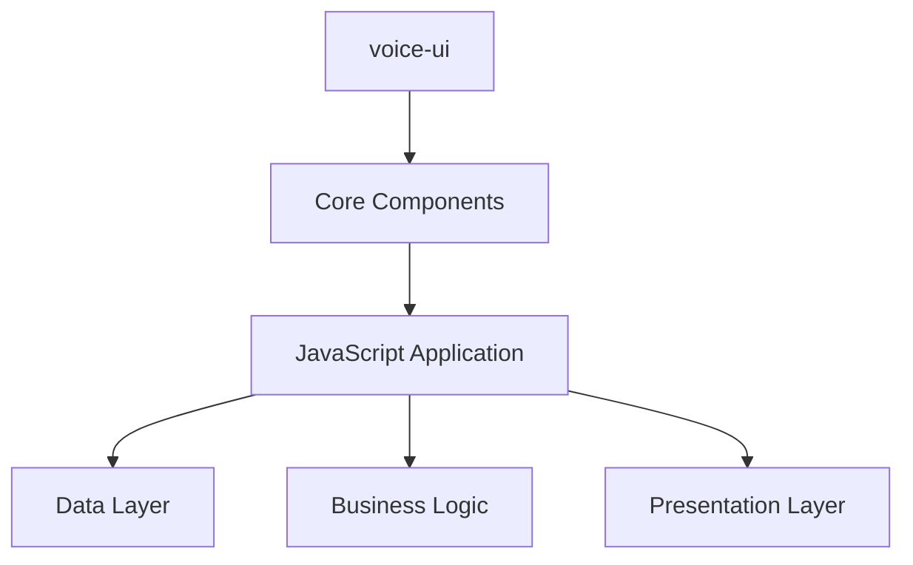

# Architecture Overview - voice-ui

## Repository Information
- **Name**: voice-ui
- **Language**: JavaScript
- **Size**: 2MB
- **Description**: Client for Audio call

## Technology Stack
- JavaScript

## System Architecture

### High-Level Components
Based on the repository structure analysis, the following components have been identified:

- **Core Application**: Main application logic and entry points
- **Configuration**: Application configuration and settings
- **Testing**: No test infrastructure detected
- **Documentation**: Limited documentation available

### Architecture Diagram

## Recommendations
- Consider implementing microservices architecture for better scalability
- Add comprehensive logging and monitoring
- Implement proper error handling and validation
- Consider containerization with Docker

## Next Steps
1. Review component dependencies
2. Identify potential architectural improvements
3. Plan for scalability and performance optimization
